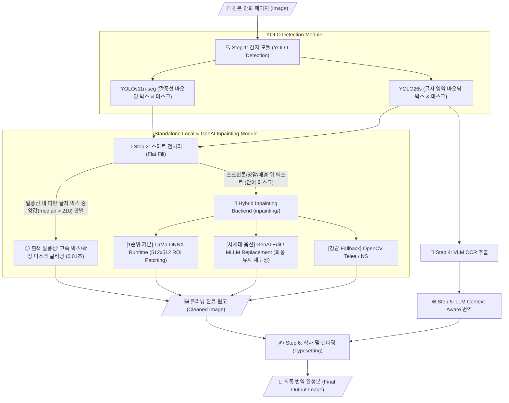

# Manga-Trans v2 시스템 아키텍처 (System Architecture)

본 문서는 만화/웹툰 자동 감지, 클리닝(인페인팅), OCR 및 번역 합성 파이프라인인 **Manga-Trans v2**의 전체 아키텍처와 모듈 구조를 상세히 정의합니다.

---

## 1. 파이프라인 전체 데이터 흐름도 (End-to-End Pipeline Flow)

---

## 2. 핵심 디렉토리 및 모듈 역할

| 모듈 경로 | 주요 역할 및 기능 설명 |
| :--- | :--- |
| `main.py` | 파이프라인 오케스트레이터. 설정 로드, 감지 ➔ 인페인팅 ➔ OCR ➔ 번역 ➔ 렌더링 전체 단계 제어 |
| `config.yaml` | 전체 시스템 설정 파일 (모델 경로, 임계값, 인페인팅 백엔드 선택, GenAI 편집 프롬프트) |
| `detection/yolo_detector.py` | Ultralytics PyTorch 기반 YOLO 감지기. SOTA 다중 클래스 모델(`YOLOv11n` 말풍선 + `YOLO26s` 글자) 추론 및 NMS 후처리 |
| `comfy_client.py` | 고속 전처리 클리너(`flat_fill`) 구현 및 외부 ComfyUI 연동 호환 레이어 |
| `inpainting/` | **[신설] 독립 실행형 로컬 & 생성형 AI 인페인팅 패키지** |
| ├── `inpainting/base.py` | 모든 인페인팅 엔진이 규격화하는 추상 베이스 클래스 (`BaseInpainter`) |
| ├── `inpainting/lama_inpainter.py` | ONNX Runtime 기반 고성능 LaMa 추론 엔진 (`LaMaONNXInpainter`) |
| ├── `inpainting/genai_inpainter.py` | 생성형 AI 이미지 편집/대체 엔진 인터페이스 (`GenAIEditInpainter`) |
| ├── `inpainting/opencv_inpainter.py` | 경량 내장 인페인팅 엔진 (`OpenCVInpainter`) |
| └── `inpainting/engine.py` | `config.yaml` 설정에 따른 통합 팩토리 및 스위칭 컨트롤러 |
| `ocr/vlm_ocr.py` | Vision-Language Model(Qwen2-VL, Gemma 등)을 통한 일본어/영어 텍스트 정밀 추출 |
| `translation/translator.py` | OpenRouter API / LLM을 이용한 문맥 반영 번역 및 고유명사/용어집(Glossary) 보존 처리 |
| `scripts/render_text.py` | 한국어 세로쓰기/가로쓰기 자동 줄바꿈 및 말풍선 내 정렬 합성 렌더러 |

---

## 3. 주요 아키텍처 설계 원칙

1. **완전 독립 실행성 (Zero External Dependency Standalone)**:
   - 외부 ComfyUI HTTP 서버(`localhost:8188`) 의존성을 탈피하고, 가중치(`models/lama.onnx`) 자동 관리 및 로컬 연산으로 100% 독립 실행됩니다.
2. **하이브리드 분기 처리 (Hybrid Performance Optimization)**:
   - 90% 비중의 일반 흰색 말풍선은 중앙값 기반 고속 클리닝(`flat_fill`)으로 0.01초 처리하고, 복잡한 배경 위 텍스트에만 딥러닝 추론을 집중합니다.
3. **생성형 텍스트 재구성 패러다임 (Generative Replacement)**:
   - 배경 위 텍스트를 단순 보간(Smoothing)하여 뭉개지 않도록, 차세대 생성형 AI 편집 모듈(`GenAIEditInpainter`)을 통해 일러스트 화풍과 타이포그래피를 유지하며 한국어로 대체하는 인터페이스를 갖추고 있습니다.
